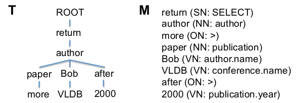
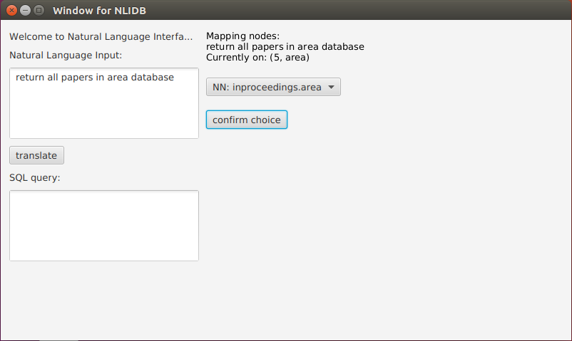
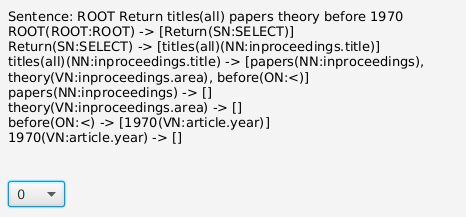
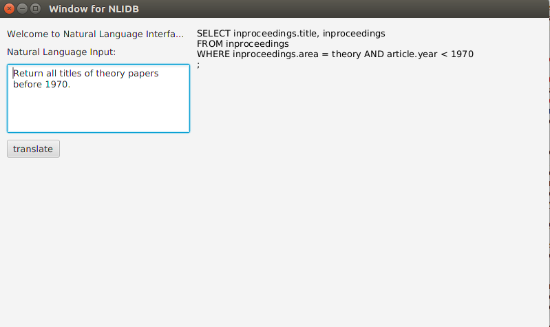

# Natural Language Interface to DataBases (NLIDB)

### How it works.
1. Parse the input and map nodes to SQL components and database attributes.

2. Adjust the structure of the parse tree to make it syntactically valid.

3. Translate the parse tree to an SQL query.

******

change some thing to set CI

### Grammar rules of syntactically valid parse trees:

1. Q -> (SClause)(ComplexCondition)\*
2. SClause -> SELECT + GNP
3. ComplexCondition -> ON + (leftSubtree\*rightSubtree)
4. leftSubtree -> GNP
5. rightSubtree -> GNP | VN | MIN | MAX
6. GNP -> (FN + GNP) | NP
7. NP -> NN + (NN)\*(condition)\*
8. condition -> VN | (ON + VN)

Note:  
All terminal nodes are defined in the paper.  
\+ represents a parent-child relationship.  
\* represents a sibling relationship.  
One Query (Q) can must have one SClause and zero or more ComplexConditions.  
A ComplexCondition must have one ON, with a leftSubtree and a rightSubtree.  
An NP is: one NN (since an SQL query has to select at least one attribute), whose children
are multiple NNs and Conditions. (All other selected attributes and conditions are stacked
here to form a wide "NP" tree.)    

